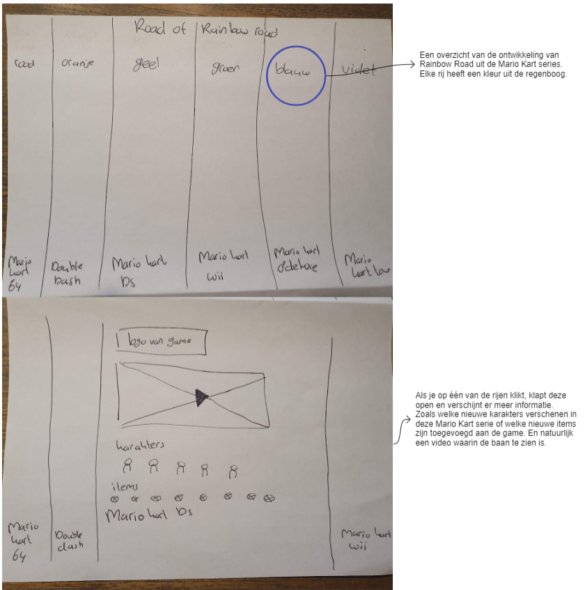
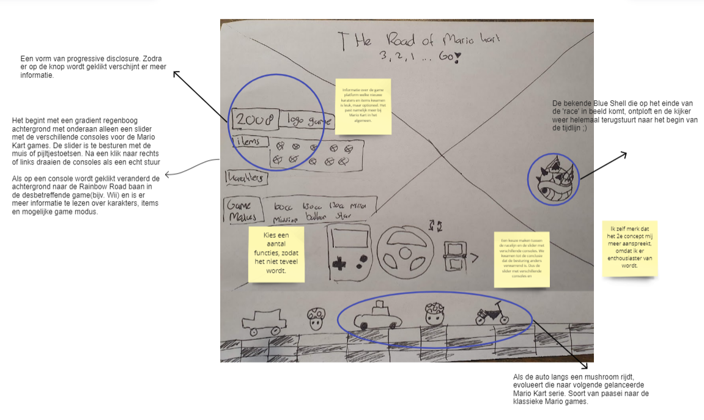
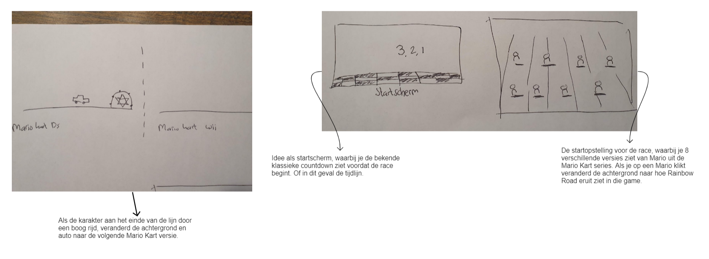
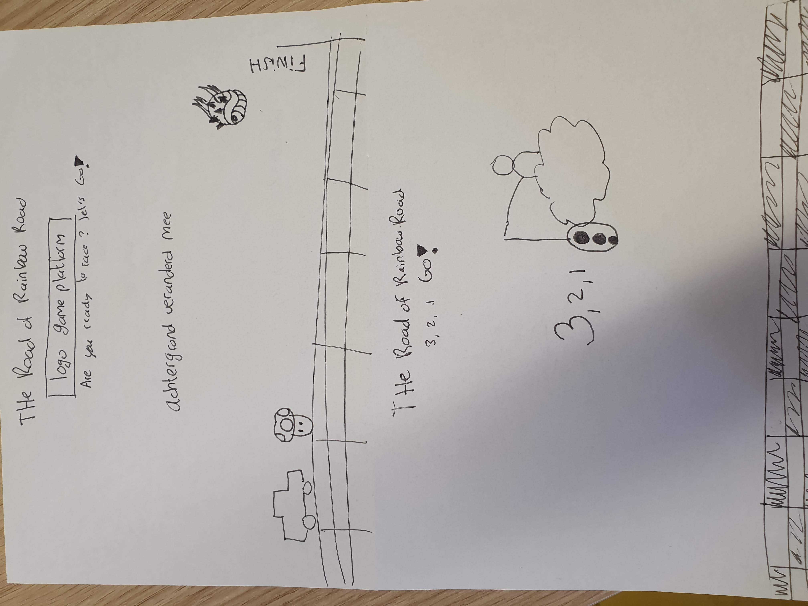

# Procesverslag
Markdown is een simpele manier om HTML te schrijven.  
Markdown cheat cheet: [Hulp bij het schrijven van Markdown](https://github.com/adam-p/markdown-here/wiki/Markdown-Cheatsheet).

## Jij

### Ontwerper:
Marleen Buchner

#### Mijn startniveau:
Mijn startniveau is: blauw

# Je plan

### De eerste versie/schets:
  Mario Kart is een klassieker die bijna iedereen wel kent. En welke course komt in elke Mario Kart game terug? Jazeker, Rainbow Road. Wat ook één van mijn favoriete Mario Kart baan is.
  Voor sommigen spelers een baan vol trauma's, omdat je regelmatig van de baan vliegt en voor andere weer niet. 
  Ik heb er dus voor gekozen om een tijdlijn te maken van Rainbow Road. 

 #### Schets van eerste concept:
   
    Het scherm is verdeeld in de kleuren van de regenboog. Elke rij heeft een eigen kleur en Mario Kart versie. 
    Als je op één van de rijen klikt, klapt deze open en verschijnt er meer informatie.
    Zoals welke nieuwe karakters verschenen in deze Mario Kart serie of welke nieuwe items zijn toegevoegd aan de game. En natuurlijk een video waarin de baan te zien is.

  #### Schetsen van tweede concept: 
   
    Het idee is om Mario te laten 'racen' door de versies van Rainbow Road heen. Bij elke mushroom veranderd Mario naar een andere game versie van Mario Kart. Ook zie je de achtergrond veranderen naar de Rainbow Road course uit dezelfde game. 

    De mushroom is eigenlijk een soort van Easter egg verwijzing naar de Super Mario Bros game. Als Mario in het spel een mushroom pakte wordt hij groter. Het idee is dan op een leuke manier de upgrade te laten zien van Mario in Mario Kart en natuurlijk Rainbow Road zelf. 

    Het lijkt er op dat Mario de finish gaat bereiken, maar dan vliegt er een Blue shell het scherm binnen. Waarna de gebruiker weer terug wordt gegooid naar het begin van de tijdlijn.  Dit is natuurlijk een verwijzing naar de bekende Blue shell uit de Mario Kart games. De Blue shell staat er om bekend om de race van de speler die op de eerste plaats rijdt te dwarsbomen. Met soms als resultaat dat de hele ranking wordt omgegooid. 

 #### Schetsen van losse ideeën die te combineren zijn met concept 2:
  
    - startscherm, waarbij je de bekende countdown ziet voordat de race begint. Of in dit geval de tijdlijn.
    - De startopstelling voor de race, waarbij je 8 verschillende versies ziet van Mario uit de Mario Kart series. Als je op een Mario klikt veranderd de achtergrond naar hoe Rainbow Road eruit ziet in die game.
    - Als de auto langs een mushroom rijdt, evolueert die naar volgende gelanceerde Mario Kart serie. Soort van paasei naar de klassieke Mario games.
    - Zodra er op een knop wordt geklikt verschijnt er meer informatie.
    - Een slider met verschillende consoles voor de Mario Kart games. De slider is te besturen met de muis of pijltjestoetsen. Na een klik naar rechts of links draaien de consoles als een echt stuur. Als op een console wordt geklikt veranderd de achtergrond naar de Rainbow Road baan in de desbetreffende game(bijv. Wii) en is er meer informatie te lezen over karakters, items en mogelijke game modus.

  ### Mijn ambitie: 
  Aan deze technieken/punten wil ik werken:
  - Het vak halen ;)
  - Een voldoende halen
  - Meerdere elementen maken door het gebruik van animaties(keyframes) interacties met Javascript.
 

## Voortgang/Feedback 1

  
Mijn bevindingen + wijzigingen

  ### Bevinding 1:
  Een keuze maken tussen de verschillende concepten Ik heb eigenlijk twee concepten, maar ik had nog geen keuze gemaakt welke ik verder ga uitwerken. En welke losse ideeën ik weg laat of juist uitwerk. 

  #### oplossing:
  Tijdens het toelichten van mijn concepten aan medestudenten merkte ik dat ik enthousiaster werd over het tweede concept. Ik heb dus de keuze gemaakt om het tweede concept verder uit te werken. Ook kwamen we tot de conclusie dat het eerste concept een beetje statisch is, waardoor het ook minder leuk is om te maken. 

  ### Bevinding 2:
  Keuze maken uit de losse ideeën. Ik had natuurlijk veel losse ideeën, maar het is niet haalbaar en mooi voor het ontwerp om alles te gaan uitwerken. 

  #### oplossing:
  Beschrijving hoe je het hebt hebt opgelost of als het niet gelukt is hoe je het zou oplossen (tekst en afbeelding(en)).
  Ik kreeg als feedback om niet alle functies te kiezen om uit te gaan werken. Zodat het niet teveel wordt. 

  Informatie over de game platform welke nieuwe karaters en items kwamen is leuk, maar optioneel. Het past namelijk meer bij Mario Kart in het algemeen

  Een keuze maken tussen de racelijn en de slider met verschillende consoles. We kwamen tot de conclusie dat de besturing anders verwarrend is. Omdat beide elementen bijna op dezelfde plek komen te staan. Op basis van mijn niveau vond ik zelf de racelijn het meest haalbare om te gaan maken. 

  ### Bevinding 3:
  Final concept schetsen om overzicht te krijgen wat ik ga maken.

  #### oplossing:
  Het is natuurlijk handig om een schets te hebben van je eindconcept, zodat je weet wat je wilt gaan maken. Daarnaast helpt het mij ook om meer overzicht te krijgen. Zoals met welk element ga ik starten. 
  

## Voortgang/Feedback 2

  
Mijn bevindingen + wijzigingen (minimaal 5)

  - Elementen netjes uitgelijnd. 
  - Let wel even op de leesbaarheid en voldoende contrast. Even testen met inspect. Ook als het darkmode is. 
  - Gebruik maken van Fonts. Kijken wel past naar het design. 
  - Bij de buttons nog meerdere states uitwerken.

  - Misschien van verkeerslicht een ul/li maken.
  - Handige shortcut voor netjes inspringen alt shift F
  - Netjes structuur in CSS zelfde volgorde HTML 
  - Welke onderbouwing heb ik om classes met camelCase te schrijven en de custom properties met-streepjes in de namen

  Is het handig om bij custom properties om de kleur zwart apart te maken en die weer gebruiken in bijvoorbeeld de drop shadow. Dus een custom propertie in een custom propertie. 

  Foto plaatsen van feedbackformulier en plaatsen in readme

  ### Bevinding 1:
  Omschrijving van wat er nog niet orde was (tekst en afbeelding(en)).

  #### oplossing:
  Beschrijving hoe je het hebt hebt opgelost of als het niet gelukt is hoe je het zou oplossen (tekst en afbeelding(en)).

  ### Bevinding 2:
  Omschrijving van wat er nog niet orde was (tekst en afbeelding(en)).

  #### oplossing:
  Beschrijving hoe je het hebt hebt opgelost of als het niet gelukt is hoe je het zou oplossen (tekst en afbeelding(en)).

  ### Bevinding 3:
  ...

## Voortgang/Feedback 3

  
Mijn bevindingen + wijzigingen (minimaal 5)

  
  ### Bevinding 1:
  Omschrijving van wat er nog niet orde was (tekst en afbeelding(en)).

  #### oplossing:
  Beschrijving hoe je het hebt hebt opgelost of als het niet gelukt is hoe je het zou oplossen (tekst en afbeelding(en)).

  ### Bevinding 2:
  Omschrijving van wat er nog niet orde was (tekst en afbeelding(en)).

  #### oplossing:
  Beschrijving hoe je het hebt hebt opgelost of als het niet gelukt is hoe je het zou oplossen (tekst en afbeelding(en)).

  ### Bevinding 3:
  ...

## Reflectie

  
Mijn eindresultaat & persoonlijke ontwikkeling

  ### Je uitkomst - karakteristiek screenshot(s):
  
  
  
  Vanwege tijdgebrek heb ik ervoor gekozen om dit achterwege te laten en alleen het stoplicht met de cloudguy uit te werken. Daarnaast is het belangrijker om de Evolutie van Mario Kart Rainbow Road te laten zien. 

  Andere dingen die niet gelukt zijn. Was leuk geweest om erin te hebben, maar niet essentieel zoals countdown geluid uit de game. Of blue shell 
  bron geluid: https://quicksounds.com/sound/23/mario-kart-race-start

  Blue shell ontploft zoals de oefening met de kikker en Mario staat weer bij het beginpunt. 

## Bronnenlijst afbeeldingen

1. https://www.deviantart.com/betatus/art/Mario-Kart-ICON-412302604 - afbeelding voor fav icon
2. https://static.wikia.nocookie.net/mariokart/images/2/20/Fishin'_Lakitu_(Mario_Kart_7).png/revision/latest/scale-to-width-down/1000?cb=20131229194833 - Afbeelding van Latiku(cloudguy) voor de countdown. De afbeelding wel aangepast in Photoshop, omdat ik het verkeerslicht met CSS wilde maken.
3. https://mariokart.fandom.com/wiki/Spiny_Shell  - Afbeelding van Blue Shell
4. https://mariokart.fandom.com/wiki/Mushroom_(item) - Afbeelding van rode mushroom
5. https://mariokart.fandom.com/wiki/Mushroom_(item)  - Alle mushroom afbeeldingen. Deze wel aangepast in Photoshop.
6. https://nintendoeverything.com/horis-mario-kart-8-accessories-will-be-available-in-north-america/ - Stuurwiel voor cursor:hover

7. https://commons.wikimedia.org/wiki/File:Super-Mario-Kart-Logo.png - Logo van Super Mario Kart 1992
8. https://www.pngkey.com/maxpic/u2q8i1u2o0q8i1e6/ - Logo van Mario Kart Super Circuit 2001
9. https://www.deviantart.com/ringostarr39/art/Mario-Kart-DS-logo-738743863 - Logo van Mario Kart DS 2005
10. https://commons.wikimedia.org/wiki/File:Mariokartwiilogo.png - Logo van Mario Kart Wii 2008
11. https://logos.fandom.com/wiki/Mario_Kart_7 - Logo van Mario Kart 7 2011
12. https://logos.fandom.com/wiki/Mario_Kart_8_Deluxe - Logo van Mario Kart 8 Deluxe 2017

13. https://4.bp.blogspot.com/-K2FuO2FjJHk/UwEyZTWL7BI/AAAAAAAAApg/dEf-azZKXcM/s1600/SMK4.png - Rainbow Road 1992 voor achtergrond
14. https://saveupdata.com/news/every-version-of-mario-karts-rainbow-road-ranked/ - Rainbow Road 2001 voor achtergrond
15. https://www.sporcle.com/games/Bowserdude/mario-kart-rainbow-road-medley - Rainbow Road 2005 voor achtergrond
16. https://www.wallpaperup.com/318535/screenshots_Mario_Kart_rainbow_road.html - Rainbow Road Wii 2008 voor achtergrond
17. https://mariokart.fandom.com/wiki/Rainbow_Road_(3DS) - Rainbow Road 3DS 2011 voor achtergrond
18. https://mariokart.fandom.com/wiki/Rainbow_Road_(N64) - Rainbow Road 2017 voor achtergrond

19. https://www.deviantart.com/betatus/art/Mario-Kart-ICON-412302604 - Mario karakter SNES 1992
20. https://kuribo64.net/get.php?id=YJEUvarXYe9J1Ygn - Mario karakter DS 2005 
21. https://www.youtube.com/watch?v=jr3EZPOthSo - Mario karakter GBA 2001
22. https://www.youtube.com/watch?v=MKnNYX3E8dI - Mario karakter Wii 2008
23. https://www.youtube.com/watch?v=VRrcXQb-TrM  - Mario karakter kart 7 2011
24. https://www.youtube.com/watch?v=zfd6vKg0f6s - Mario karakter kart 8 deluxe 2017

25. https://www.youtube.com/watch?v=-jqqHOF89b8 - Content resource voor de tijdlijn
26. https://appdevelopermagazine.com/the-evolution-of-mario-kart/ - Informatie voor tijdlijn
27. https://9gag.com/gag/aADYAE9 - Informatie voor tijdlijn
28. https://www.dafont.com/super-mario-256.font - Bron fonts
29. https://fontmeme.com/fonts/mario-kart-f2-font/#previewtool - Mario kart font
30. https://www.fontsquirrel.com/tools/webfont-generator - Voor omzetten Font-types van ttf naar woff & woff2.

## Bronnenlijst voor code
1. https://codesandbox.io/s/6h6jg?file=/index.html - CSS code voor het maken en animeren van het verkeerslicht. 
2. https://developer.mozilla.org/en-US/docs/Web/CSS/gradient/repeating-conic-gradient - CSS code om een schaakbord pattern te maken voor de finishlijn.
3. https://css-tricks.com/css3-gradients/ - Om een Regenboog gradient te maken voor de achtergrond.

