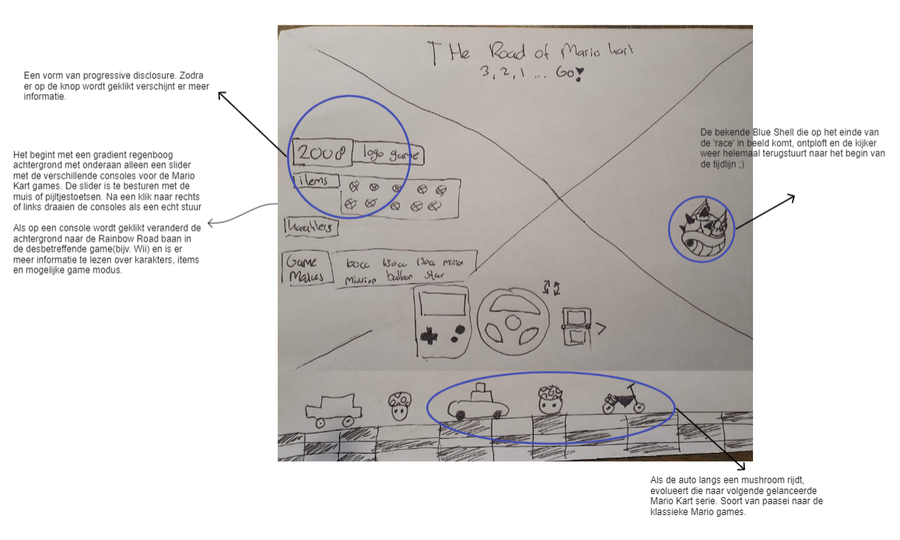
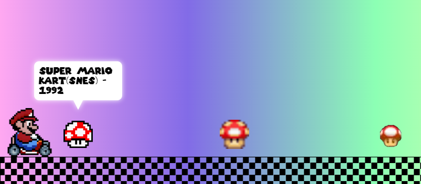

## Jij

### Ontwerper:
Marleen Buchner

#### Mijn startniveau:
Mijn startniveau is: blauw

# Je plan

### De eerste versie/schets:
  Mario Kart is een klassieker die bijna iedereen wel kent. En welke course komt in elke Mario Kart game terug? Jazeker, Rainbow Road. Wat ook één van mijn favoriete Mario Kart baan is.
  Voor sommigen spelers een baan vol trauma's, omdat je regelmatig van de baan vliegt en voor andere weer niet. 
  Ik heb er dus voor gekozen om een tijdlijn te maken van Rainbow Road. 

  #### Schets van eerste concept:
  Het scherm is verdeeld in de kleuren van de regenboog. Elke rij heeft een eigen kleur en Mario Kart versie. 
  Als je op één van de rijen klikt, klapt deze open en verschijnt er meer informatie.
  Zoals welke nieuwe karakters verschenen in deze Mario Kart serie of welke nieuwe items zijn toegevoegd aan de game. En natuurlijk een video waarin de baan te zien is.
   

  #### Schets van tweede concept: 
   Het idee is om Mario te laten 'racen' door de versies van Rainbow Road heen. Bij elke mushroom veranderd Mario naar een andere game versie van Mario Kart. Ook zie je de achtergrond veranderen naar de Rainbow Road course uit dezelfde game. De mushroom is eigenlijk een soort van Easter egg verwijzing naar de Super Mario Bros game. Als Mario in het spel een mushroom pakte wordt hij groter. Het idee is dan op een leuke manier de upgrade te laten zien van Mario in Mario Kart en natuurlijk Rainbow Road zelf. Het lijkt er op dat Mario de finish gaat bereiken, maar dan vliegt er een Blue shell het scherm binnen. Waarna de gebruiker weer terug wordt gegooid naar het begin van de tijdlijn.  Dit is natuurlijk een verwijzing naar de bekende Blue shell uit de Mario Kart games. De Blue shell staat er om bekend om de race van de speler die op de eerste plaats rijdt te dwarsbomen. Met soms als resultaat dat de hele ranking wordt omgegooid. 
   
 

  #### Schetsen van losse ideeën die te combineren zijn met concept 2:
  1. startscherm, waarbij je de bekende countdown ziet voordat de race begint. Of in dit geval de tijdlijn.
  2. De startopstelling voor de race, waarbij je 8 verschillende versies ziet van Mario uit de Mario Kart series. Als je op een Mario klikt veranderd de achtergrond naar hoe Rainbow Road eruit ziet in die game.
  3. Als de auto langs een mushroom rijdt, evolueert die naar volgende gelanceerde Mario Kart serie. Soort van paasei naar de klassieke Mario games.
  4. Zodra er op een knop wordt geklikt verschijnt er meer informatie.
  5. Een slider met verschillende consoles voor de Mario Kart games. De slider is te besturen met de muis of pijltjestoetsen. Na een klik naar rechts of links draaien de consoles als een echt stuur. Als op een console wordt geklikt veranderd de achtergrond naar de Rainbow Road baan in de desbetreffende game(bijv. Wii) en is er meer informatie te lezen over karakters, items en mogelijke game modus.
  

### Mijn ambitie: 
  Aan deze technieken/punten wil ik werken:
  - Het vak halen ;)
  - Een voldoende halen
  - Meerdere elementen maken door het gebruik van animaties(keyframes) en interacties met Javascript.
  - Iets meer plezier hebben in coderen(knutselen) 
 

## Voortgang/Feedback 1

  
Mijn bevindingen + wijzigingen

  ### Bevinding 1:
  Voor de eerste feedbacksessie had ik meerdere schetsen gemaakt van concepten. Ik had twee hoofdconcepten en een aantal losse ideeën die ik kan combineren met de hoofdconcepten. Nu stond ik dus wel op het punt dat ik een keuze moest maken tussen de twee concepten.
  Ik had dus nog geen keuze gemaakt welk concept ik ga uitwerken. En welke losse ideeën ik ga toepassen.
 
  #### oplossing:
  Tijdens het toelichten van mijn concepten aan mijn medestudenten merkte ik dat ik enthousiaster werd over het tweede concept. Het concept waarbij ik Mario laat racen door de versies van Rainbow Road. We kwamen ook tot de conclusie dat het eerste concept een beetje statisch is. Waardoor het minder leuk kan zijn om deze te gaan maken. Bovendien past het tweede concept meer bij Mario Kart
  

  ### Bevinding 2:
  
  Een keuze maken uit losse ideeën. Ik had natuurlijk veel losse ideeën, maar het was niet haalbaar en mooi voor het ontwerp om alles te gaan uitwerken. 

  #### oplossing:
  Ik kreeg als feedback om niet alle functies te kiezen om uit te gaan werken. Zodat het niet teveel wordt. 
  Ik kwam ook tot de conclusie dat de besturing verwarrend kan zijn als ik de racelijn en slider met verschillende consoles uitwerk. 
  Omdat beide elementen bijna op dezelfde plek komen te staan. Op basis van mijn niveau vond ik zelf de racelijn het meest haalbare om te gaan uitwerken. 
  het idee om informatie weer te geven over de game platform zoals welke nieuwe karakters en items uitkwamen is leuk, maar niet essentieel. Het paste naar mijn mening meer bij Mario Kart in het algemeen. 

  ### Bevinding 3:
  Final concept schets om overzicht te krijgen wat ik ga maken.

  #### oplossing:
  Het is natuurlijk handig om een schets te hebben van je eindconcept, zodat je weet wat je wilt gaan maken. Daarnaast helpt het mij ook om meer overzicht te krijgen. Zo gaat het makkelijk om te bepalen met welk element ik ga starten. 
  

  ### Bevinding 4:
  Schaakbord pattern maken voor finishlijn

  #### oplossing:
  Ik wilde als racelijn een finishlijn patroon te maken. Ik ben toen gaan zoeken naar een css code met een schaakpatroon.
  Ik vond uiteindelijk de volgende bron: https://developer.mozilla.org/en-US/docs/Web/CSS/gradient/repeating-conic-gradient - CSS code om een schaakbord pattern te maken voor de finishlijn. 
  Met hulp van Sanne heb ik de CSS code geperfectioneerd. Daarvoor is gebruikt gemaakt van repeating-conic-gradient. 

  ### Bevinding 5:
  Verkeerslicht voor countdown 
  Voor het beginscherm leek het mij heel leuk om een countdown te laten zien met de bekende cloudguy uit de Mario Kart Game.
  En natuurlijk moet er dan een verkeerslicht in voorkomen. Maar ik wilde voor het verkeerslicht geen image gebruiken, want het vaak draait natuurlijk om CSS. 

  Dus om het verkeerslicht te maken ben ik op zoek gegaan naar de juiste CSS code. Ik vond deze bron hiervoor: https://codesandbox.io/s/6h6jg?file=/index.html. Dankzij een tip van een klasgenoot koos ik ervoor om de cloudguy te editten in Photoshop, zodat alleen de cloudguy en de vishaak overblijft. Het verkeerslicht heb ik uiteindelijk zo gepositioneerd dat hij lijkt als of het aan het vishaakje hangt. 

## Voortgang/Feedback 2

  
Mijn bevindingen + wijzigingen

  
  

  ### Bevinding 1:
  Let wel even op de leesbaarheid en voldoende contrast tussen de kleuren. Ook als het darkmode is.
  Het is handig om bij custom properties om de kleur zwart apart te maken en die weer gebruiken in bijvoorbeeld de drop shadow. Dus een custom propertie in een custom propertie.  

  #### oplossing:
  Ik kreeg van Milan de tip om ook voor de kleuren zwart en wit een aparte custom propertie te maken. Want in de al gemaakte custom properties kwamen deze kleuren veel terug. Ik had namelijk meerdere keren de kleur zwart gedefinieerd. Ik heb uiteindelijk gekeken naar waar deze kleuren het vaakst terugkwamen. En op basis daarvan een custom property naam gegeven. De kleur wit kwam bijvoorbeeld vaakst terug als drop-shadow kleur.

  Daarnaast heb ik de kleuren van de tekst aangepast, zodat het nog leesbaar is. Ook als er een andere achtergrond in beeld staat. 

  ### Bevinding 2:
  Maak gebruik van Fonts, maar kijk wel welke past bij het design en concept.  

  #### oplossing:
  Dit spreekt natuurlijk voor zichzelf. Maar op het moment van de feedback had ik nog geen specifieke fonts gebruikt. Ik had bijvoorbeeld nog geen Google fonts ingeladen. Dit heb ik later natuurlijk wel gedaan door @font-face te gebruiken. 

  ### Bevinding 3:
  Bij de buttons nog meerdere states uitwerken. zoals hover, focus en active. Ook dit heb ik later tijdens het knutselen uitgewerkt door per button de css toe te voegen. 

## Voortgang/Feedback 3

  
Mijn bevindingen + wijzigingen 

  We hebben gezamenlijk het beoordelingsformulier doorgenomen en kwamen tot de conclusie dat bijna alle punten wel redelijk voldoende waren uitgewerkt.
  Er moesten nog een paar kleine puntjes worden uitgewerkt, zoals de button states. Maar daar was ik op dat moment ook mee aan het werk. 

  Een aantal andere punten die ik nog moest afronden waren:
  1. Het compleet maken van de custom properties en de root. 
  2. Toepassen van fonts en ook testen op een andere laptop. Zodat de fonts op elk scherm werken. 
  
  
  ### Bevinding 1:
  Ik wilde het tekstwolkjes als popup in beeld laten verschijnen. En de tekstwolkjes zijn niet allemaal bij het eerste scherm meteen zichtbaar. 

  #### oplossing:
 
 
Ik ben eerst op zoek gegaan naar een bron met daarin een popup effect. bron: https://www.w3schools.com/howto/tryit.asp?filename=tryhow_js_popup
Daarna ben ik gaan kijken naar de Javascript. Ik wist dat ik de tekst wilde laten verschijnen nadat erop een mushroom geklikt was. Er moest natuurlijk een nieuwe class op de paragraaf komen, waarin ik de animatie kon plaatsen. Want de tekst mocht pas zichtbaar zijn na de klik. 
Met hulp van Sanne kwam ik er achter dat wel elk tekstwolkje een eigen variabel krijgt in de Javascript. Want anders bleef de tekst ontzichtbaar.

## Reflectie

  
Mijn eindresultaat & persoonlijke ontwikkeling

  ### Je uitkomst - karakteristiek screenshot(s):
  
  
  

## Bronnenlijst afbeeldingen

- Veel vann de afbeeldingen heb ik nog wel aangepast in Photoshop, zodat de afbeeldingen geen achtergrond hebben.

1. https://www.deviantart.com/betatus/art/Mario-Kart-ICON-412302604 - afbeelding voor fav icon
2. https://static.wikia.nocookie.net/mariokart/images/2/20/Fishin'_Lakitu_(Mario_Kart_7).png/revision/latest/scale-to-width-down/1000?cb=20131229194833 - Afbeelding van Latiku(cloudguy) voor de countdown. De afbeelding wel aangepast in Photoshop, omdat ik het verkeerslicht met CSS wilde maken.
3. https://mariokart.fandom.com/wiki/Spiny_Shell  - Afbeelding van Blue Shell
4. https://mariokart.fandom.com/wiki/Mushroom_(item) - Afbeelding van rode mushroom
5. https://mariokart.fandom.com/wiki/Mushroom_(item)  - Alle mushroom afbeeldingen. Deze wel aangepast in Photoshop.
6. https://nintendoeverything.com/horis-mario-kart-8-accessories-will-be-available-in-north-america/ - Stuurwiel voor cursor:hover

7. https://commons.wikimedia.org/wiki/File:Super-Mario-Kart-Logo.png - Logo van Super Mario Kart 1992
8. https://www.pngkey.com/maxpic/u2q8i1u2o0q8i1e6/ - Logo van Mario Kart Super Circuit 2001
9. https://www.deviantart.com/ringostarr39/art/Mario-Kart-DS-logo-738743863 - Logo van Mario Kart DS 2005
10. https://commons.wikimedia.org/wiki/File:Mariokartwiilogo.png - Logo van Mario Kart Wii 2008
11. https://logos.fandom.com/wiki/Mario_Kart_7 - Logo van Mario Kart 7 2011
12. https://logos.fandom.com/wiki/Mario_Kart_8_Deluxe - Logo van Mario Kart 8 Deluxe 2017

13. https://4.bp.blogspot.com/-K2FuO2FjJHk/UwEyZTWL7BI/AAAAAAAAApg/dEf-azZKXcM/s1600/SMK4.png - Rainbow Road 1992 voor achtergrond
14. https://saveupdata.com/news/every-version-of-mario-karts-rainbow-road-ranked/ - Rainbow Road 2001 voor achtergrond
15. https://www.sporcle.com/games/Bowserdude/mario-kart-rainbow-road-medley - Rainbow Road 2005 voor achtergrond
16. https://www.wallpaperup.com/318535/screenshots_Mario_Kart_rainbow_road.html - Rainbow Road Wii 2008 voor achtergrond
17. https://mariokart.fandom.com/wiki/Rainbow_Road_(3DS) - Rainbow Road 3DS 2011 voor achtergrond
18. https://mariokart.fandom.com/wiki/Rainbow_Road_(N64) - Rainbow Road 2017 voor achtergrond

19. https://www.deviantart.com/betatus/art/Mario-Kart-ICON-412302604 - Mario karakter SNES 1992
20. https://kuribo64.net/get.php?id=YJEUvarXYe9J1Ygn - Mario karakter DS 2005 
21. https://www.youtube.com/watch?v=jr3EZPOthSo - Mario karakter GBA 2001
22. https://www.youtube.com/watch?v=MKnNYX3E8dI - Mario karakter Wii 2008
23. https://www.youtube.com/watch?v=VRrcXQb-TrM  - Mario karakter kart 7 2011
24. https://www.youtube.com/watch?v=zfd6vKg0f6s - Mario karakter kart 8 deluxe 2017

25. https://www.youtube.com/watch?v=-jqqHOF89b8 - Informatie voor content tijdlijn
26. https://appdevelopermagazine.com/the-evolution-of-mario-kart/ - Informatie voor content tijdlijn
27. https://9gag.com/gag/aADYAE9 - Informatie voor content tijdlijn
28. https://www.dafont.com/super-mario-256.font - Mario kart fonts
29. https://fontmeme.com/fonts/mario-kart-f2-font/#previewtool - Mario kart font nr 2
30. https://www.fontsquirrel.com/tools/webfont-generator - Voor omzetten Font-types van ttf naar woff & woff2.

## Bronnenlijst voor code
1. https://codesandbox.io/s/6h6jg?file=/index.html - CSS code voor het maken en animeren van het verkeerslicht. 
2. https://developer.mozilla.org/en-US/docs/Web/CSS/gradient/repeating-conic-gradient - CSS code om een schaakbord pattern te maken voor de finishlijn.
3. https://css-tricks.com/css3-gradients/ - Om een Regenboog gradient te maken voor de achtergrond.
4. https://www.w3schools.com/howto/tryit.asp?filename=tryhow_js_popup - Voor popup effect voor tekstwolkje.
5. https://alistapart.com/article/now-you-see-me/ - Waarvoor visibility of display:none gebruiken.
6. En tijdens de les natuurlijk uitleg en hulp gekregen door Sanne met het schrijven van code.

